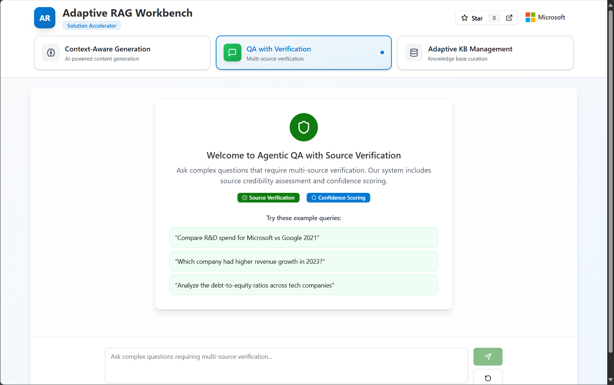

<!--
---
name: Adaptive RAG Workbench - Enterprise RAG Solution Accelerator
description: A comprehensive solution accelerator for advanced Retrieval-Augmented Generation patterns using Azure OpenAI, Semantic Kernel, and modern web technologies.
page_type: sample
languages:
- python
- typescript
- bicep
- azdeveloper
products:
- azure-openai
- azure-cognitive-search
- azure-ai-search
- azure-app-service
- azure-container-apps
- azure-key-vault
- azure-monitor
- azure-ai-foundry
- azure-ai-agents
- azure-ai-document-intelligence
- copilot-studio
urlFragment: adaptive-rag-workbench
---
-->

<p align="center">
  <br>
  <b>Adaptive RAG Workbench · Enterprise RAG Solution Accelerator</b>
</p>

[](https://github.com/codespaces/new?hide_repo_select=true&ref=main&repo=Azure-Samples/adaptive-rag-workbench&machine=basicLinux32gb&devcontainer_path=.devcontainer%2Fdevcontainer.json)
[](https://vscode.dev/redirect?url=vscode://ms-vscode-remote.remote-containers/cloneInVolume?url=https://github.com/Azure-Samples/adaptive-rag-workbench)

> 🚀 **Turbo charged by [GitHub Copilot](https://github.com/features/copilot) and [Cognition Devin](https://aka.ms/devin)**  
> 📊 **Explore detailed architecture**: [DeepWiki](https://deepwiki.com/Azure-Samples/adaptive-rag-workbench)

**Adaptive RAG Workbench** is a comprehensive Microsoft solution accelerator that demonstrates three advanced **Retrieval-Augmented Generation (RAG)** patterns for enterprise AI applications. Built with Microsoft Agent Platform capabilities, including **Azure AI Foundry Agent Service**, **M365SDK for Copilot Studio**, and open source orchestration frameworks, this solution accelerator provides production-ready patterns for:

* **Context-Aware Generation** – Intelligent content generation with citations from financial documents
* **Agentic QA with Verification** – Multi-source verification with confidence scoring and fact-checking
* **Adaptive Knowledge Base Management** – Intelligent document processing and curation

The project includes complete **azd** infrastructure templates, so `azd up` deploys the entire stack – web app, API, Azure OpenAI, and supporting services – in a single command.

> [!WARNING]
> **🚧 Active Development - Breaking Changes Expected**
> 
> This repository is under **active development**. 
> 


[Features](#features) • [Architecture](#architecture-diagram) • [Getting Started](#getting-started) • [Guidance](#guidance)

---

## User Interface

The Adaptive RAG Workbench provides an intuitive web interface for exploring advanced RAG patterns:

<table align="center">
  <tr>
    <td align="center">
      
      <br>
      <em>Agentic QA with Verification</em>
    </td>
    <td align="center">
      
      <br>
      <em>Adaptive Knowledge Base Management</em>
    </td>
  </tr>
</table>

---

## Features

* **Three Advanced RAG Patterns** – Production-ready implementations of sophisticated RAG architectures
* **Multi-Agent Orchestration** – Coordinated AI agents using Microsoft Semantic Kernel
* **Azure AI Integration** – Native Azure OpenAI, AI Search, and Document Intelligence
* **Modern Web Interface** – React + TypeScript frontend with shadcn/ui components
* **Enterprise Security** – Managed Identity, Key Vault integration, and network isolation
* **One-Click Deploy** – Complete infrastructure provisioning with `azd up`
* **Codespaces Ready** – Fully configured development environment
* **Future Integrations** – Azure AI Foundry Agent Service, LangGraph, Copilot Studio (coming soon)

### RAG Pattern Matrix

| Pattern | Description | Best For | Key Features |
|---------|-------------|----------|--------------|
| **Context-Aware Generation** | Intelligent content generation with source citations | Financial analysis, report generation | Document retrieval, citation tracking, context preservation |
| **Agentic QA with Verification** | Multi-source verification with confidence scoring | Compliance, fact-checking, research | Source credibility, confidence metrics, multi-agent coordination |
| **Adaptive KB Management** | Intelligent document processing and curation | Document management, metadata extraction | Automated processing, version control, metadata enrichment |

---

## 🏗️ Architecture

### Detailed Architecture Diagram

```mermaid
graph TB
    A[Frontend (Azure, Copilot Studio)] --> B[Backend (Container Apps)]
    B --> C[Semantic Kernel or LangGraph]
    C --> D[Orchestrator Agent]
    D --> E[Retriever Agent]
    D --> F[Writer Agent]
    D --> G[Verifier Agent]
    D --> H[Curator Agent]
    E --> I[Azure AI Search]
    F --> J[Azure AI Foundry]
    G --> J
    H --> I
    I --> K[Agentic Retrieval, Query Rewrite]
    J --> L[Models]
```

### Technology Stack

- **Frontend**: TypeScript, React
- **Backend**: FastAPI
- **AI Agent Orchestration**: Azure AI Foundry Agent Service, Semantic Kernel, LangGraph (coming soon)
- **Retrieval pipeline**: Azure AI Search with Agentic retrieval, query rewrite, hybrid search, and others
- **Document Processing**: Azure AI Document Intelligence
- **Deployment**: Azure Container Apps, Docker-ready architecture
- **Integration**: MCP, A2A, Copilot Studio (coming soon)

### Platform Architecture Diagram

<p align="center">
  <br>
  <em>Adaptive RAG Workbench · Architecture</em>
</p>


## Getting Started

You can deploy the Adaptive RAG Workbench using **GitHub Codespaces**, **VS Code Dev Containers**, or your **local environment**. The fastest path is Codespaces.


### GitHub Codespaces

1. Click **Open in GitHub Codespaces** above – the container build may take a few minutes.
2. When the terminal appears, sign in to Azure:

   ```bash
   azd auth login --use-device-code
   ```

3. Deploy the complete solution:

   ```bash
   azd up
   ```

4. Once deployment completes, the CLI will output your application URL. Open it to explore the three RAG patterns.

### VS Code Dev Containers

Prerequisites: [Docker Desktop](https://www.docker.com/products/docker-desktop) + the [Dev Containers](https://aka.ms/vscode/dev-containers) extension.

1. Click the **Dev Containers** badge above or run *Dev Containers: Open Repository in Container* from VS Code.
2. Sign in to Azure and deploy:

   ```bash
   azd auth login
   azd up
   ```

### Local Environment

#### Prerequisites

* [Azure Developer CLI (azd)](https://aka.ms/install-azd)
* [Python 3.12+](https://www.python.org/downloads/)
* [Node.js 18+](https://nodejs.org/)
* [Poetry](https://python-poetry.org/docs/#installation) for Python dependency management

#### Quickstart

```bash
# 1. Initialize from template
azd init --template Azure-Samples/adaptive-rag-workbench

# 2. Sign in to Azure
azd auth login

# 3. Deploy infrastructure and application
azd up
```

The deployment will prompt you to select:
- **Azure subscription**
- **Azure region** (recommend East US or West US 2)
- **Environment name** (used for resource naming)

After deployment, `azd` outputs your application URL and resource details.

#### Local Development

For local development after initial deployment:

```bash
# Start backend (Terminal 1)
cd backend
poetry install
poetry shell
uvicorn app.main:app --reload

# Start frontend (Terminal 2)
cd frontend
npm install
npm run dev
```

#### Container Apps Deployment (Coming Soon)

For serverless, scalable deployment:

```bash
# Deploy to Azure Container Apps
azd provision --template container-apps
azd deploy
```

#### Docker Development

For containerized local development:

```bash
# Build and run with Docker Compose
make build
make up
```

---

## Guidance

### Region Availability

Azure OpenAI and AI Search availability varies by region. Verify service availability in your preferred region:

* [Azure OpenAI Model Availability](https://learn.microsoft.com/azure/ai-services/openai/concepts/models#standard-deployment-model-availability)
* [Azure AI Search Regions](https://azure.microsoft.com/global-infrastructure/services/?products=search)

**Recommended regions**: East US, West US 2, West Europe, UK South

### Cost Estimation

Use the [Azure Pricing Calculator](https://azure.microsoft.com/pricing/calculator/) to estimate costs. Key components:

* **Azure Container Apps** – Standard tier for production workloads
* **Azure AI Foundry** – Pay-per-token for GPT-4.1, 03, and embeddings
* **Azure AI Search** – Basic tier suitable for development/testing
* **Azure Cosmos DB** – Serverless billing for document metadata
* **Azure Storage** – Standard tier for document storage

### Security Best Practices

The solution includes enterprise security features:

* **Managed Identity** – Secure service-to-service authentication
* **Azure Key Vault** – Centralized secret management
* **Network Security** – Application Gateway with WAF (optional)
* **Monitoring** – Application Insights and Azure Monitor integration

For production deployments:

1. Enable **Private Endpoints** for all Azure services
2. Configure **VNet integration** for network isolation
3. Implement **Conditional Access** policies
4. Enable **Azure Security Center** recommendations
5. Configure **backup and disaster recovery**

### Customization

#### Adding New RAG Patterns

1. **Create Agent**: Add new agent class in `backend/app/agents/`
2. **Update Orchestrator**: Modify orchestrator to include new pattern
3. **Frontend Integration**: Add new page component in `frontend/src/pages/`
4. **Configuration**: Update environment variables and deployment

#### Extending Document Support

1. **Document Processors**: Add new processors in `backend/app/processors/`
2. **Schema Updates**: Modify Cosmos DB schema for new metadata
3. **UI Components**: Add document type handlers in frontend

---

## Contributing

This project welcomes contributions and suggestions. Please follow the standard **fork → branch → pull request** workflow.

### Development Guidelines

* Use **Conventional Commits** for commit messages (`feat:`, `fix:`, `docs:`)
* Include **tests** for new features and bug fixes
* Update **documentation** for API or architectural changes
* Follow **Python PEP 8** and **TypeScript strict mode** standards

---

## License

This project is licensed under the MIT License - see the [LICENSE](LICENSE) file for details.

---

<div align="center">
  <p>🚀 <strong>Ready to build enterprise RAG solutions with Azure?</strong></p>
  <p>
    <a href="https://github.com/Azure-Samples/adaptive-rag-workbench">⭐ Star this repo</a> |
    <a href="https://github.com/Azure-Samples/adaptive-rag-workbench/issues">🐛 Report Issue</a> |
    <a href="https://github.com/Azure-Samples/adaptive-rag-workbench/discussions">💬 Start Discussion</a>
  </p>
</div>
